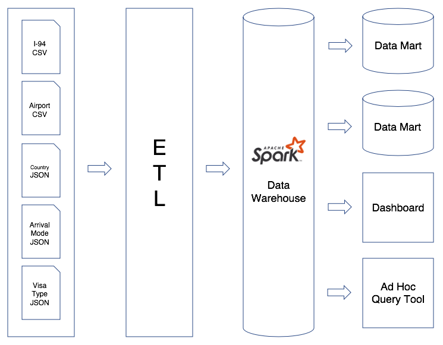

## Data Engineering Nanodegree Capstone Project
### Promoting Trade and Tourism in the US using I-94 Immigration Data

#### Purpose

- The purpose of this project is to build a Spark data warehouse and subsequently, at some point in time, data marts and dashboards that would enable the US National Tourism and Trade Office to promote trade and tourism in the United States.

- Advertising expenditure could be allocated to promoting the US in countries that send few tourists to the US.
    
- Trade policy could be focused on countries that send the most number of visitors on business visas to the US.

- Similarly, tourist attractions and natural wonders in states and cities with little tourism could be promoted.

- Universities and colleges could identify the countries that send the most number of students to the US, and actively try to recruit students from those countries to their institutions.
    
- Airlines could plan their routes and adjust their schedules based on arrivals data.

#### Details

- This project entails loading I-94 immigration data, airport, country and other dimensional data, and transforming it into fact and dimension tables using Spark.

- The source data resides in files in CSV and JSON. The fact and dimension tables are stored in Parquet tables.

- The entire process of loading flat files, transforming them into a star schema, and then storing them in Parquet tables is handled by a python script in `capstone.ipynb`.

#### Data Model

#### ETL Pipeline

#### Fact Table

- I-94: Contains an immigrant's information such as port of entry, citizenship and residency, arrival mode, visa type, arrival and departure date, age and gender.

#### Dimension Tables

- Country: Contains country code and name to provide detail behind a numeric citizenship country code and residence country code in I-94 fact table.

- Airport: Contains airport information such as name, type, city and state linked by IATA code to I-94 fact table.

- Arrival Mode: Contains detail such as arrival by air, sea or land for a numeric arrival mode in I-94 fact table.

- Visa Type: Contains detail such as business, pleasure or student visa for a numeric visa type code in I-94 fact table.

#### Technology Choice

- Apache Spark was the tool of choice because it is a cluster-computing framework that is built for big data processing.

- Simply by adding clusters to an Apache Spark setup, millions of rows of source data can be processed.

- The data warehouse tables are stored in the distributed and high-performing Parquet format, which allows for fast and simultaneous analytic processing by 100s of users.

- The entire ETL process can be contained in a Python file, and scheduled, monitored and logged with Apache Airflow on an hourly, daily or monthly basis as per business requirement.